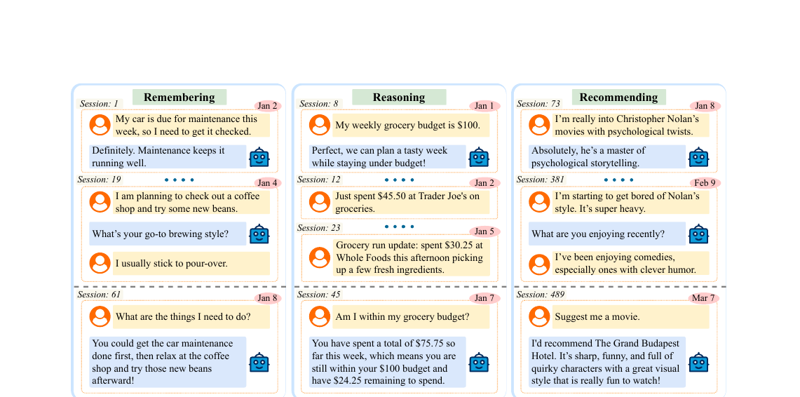

<p align="center"><a href="https://genies.com"></a></p>

# From Recall to Forgetting: Benchmarking Long-Term Memory for Personalized Agents

<p align="center"><b>Memora</b> · Accepted to ACL 2026 · <a href="https://arxiv.org/abs/2604.20006">arXiv:2604.20006</a></p>

<p align="center">
<a href="https://arxiv.org/abs/2604.20006"></a>
<a href="https://2026.aclweb.org/"></a>
<a href="LICENSE"></a>
<a href="https://www.asu.edu/"></a>
<a href="https://genies.com/"></a>
</p>

This repository contains the released dataset and the evaluation code used to
produce **Table 3** of the paper. The benchmark measures how well an LLM (or a
memory-augmented agent) can answer memory-grounded questions over a long,
realistic conversation history — with explicit credit for both *recalling*
information that should be remembered and *forgetting* information that has
been deleted or updated. Both behaviours are combined into a single score:
**FAMA** (Forgetting-Aware Memory Accuracy, paper §4.2).

<p align="center"></p>

## News

- **2026-06-09** — Added Anthropic's newly released **Claude Fable 5**, which leads the no-reasoning block (avg 28.16) and ranks second in the reasoning block (avg 25.28), and is the only model in the spot check to score above 0 on the Reasoning task at this slice.
- **2026-05-28** — Added FAMA scores for three newer frontier models — **GPT-5.5**, **Claude Opus 4.7**, and **Gemini 3.1 Pro Preview** — as an `academic_researcher`-only spot check (single persona, all three periods, multi-judge), not a full 10-persona Table-3 reproduction; see footnote ⁂.

## Results

Task-level FAMA scores (higher is better, scaled to [0, 100]), reproduced
from Table 3 of the paper. **W** = weekly, **M** = monthly, **Q** = quarterly.

<table>
<thead>
<tr>
  <th rowspan="2">Model / Agent</th>
  <th colspan="3">Remembering</th>
  <th colspan="3">Recommending</th>
  <th colspan="3">Reasoning</th>
</tr>
<tr>
  <th>W</th><th>M</th><th>Q</th>
  <th>W</th><th>M</th><th>Q</th>
  <th>W</th><th>M</th><th>Q</th>
</tr>
</thead>
<tbody>
<tr><td colspan="10"><i>Updated at 2026-06-09 — <code>academic_researcher</code> spot check ⁂ (without reasoning tokens)</i></td></tr>
<tr><td>Claude Fable 5</td>          <td>22.51</td><td>26.39</td><td>22.14</td><td>48.00</td><td>59.55</td><td>64.89</td><td>0.00</td><td>10.00</td><td>0.00</td></tr>
<tr><td>GPT-5.5</td>                  <td>14.90</td><td>26.99</td><td>22.15</td><td>64.00</td><td>51.90</td><td>64.46</td><td>0.00</td><td>0.00</td><td>0.00</td></tr>
<tr><td>Claude Opus 4.7</td>          <td>21.89</td><td>29.00</td><td>22.96</td><td>38.67</td><td>48.52</td><td>49.27</td><td>0.00</td><td>0.00</td><td>0.00</td></tr>
<tr><td>Gemini 3.1 Pro Preview</td>   <td>16.62</td><td>10.81</td><td>17.69</td><td>44.00</td><td>45.12</td><td>47.63</td><td>0.00</td><td>0.00</td><td>0.00</td></tr>
<tr><td colspan="10"><i>Updated at 2026-06-09 — <code>academic_researcher</code> spot check ⁂ (with reasoning tokens)</i></td></tr>
<tr><td>GPT-5.5</td>                  <td>26.29</td><td>17.04</td><td>23.23</td><td>64.00</td><td>57.90</td><td>73.07</td><td>0.00</td><td>0.00</td><td>0.00</td></tr>
<tr><td>Claude Fable 5</td>          <td>26.51</td><td>27.81</td><td>25.19</td><td>33.33</td><td>43.83</td><td>65.89</td><td>0.00</td><td>0.00</td><td>5.00</td></tr>
<tr><td>Claude Opus 4.7</td>          <td>28.62</td><td>24.41</td><td>23.66</td><td>42.67</td><td>39.58</td><td>51.13</td><td>0.00</td><td>0.00</td><td>0.00</td></tr>
<tr><td>Gemini 3.1 Pro Preview</td>   <td>10.19</td><td>9.38</td><td>12.96</td><td>52.00</td><td>57.74</td><td>58.08</td><td>0.00</td><td>0.00</td><td>0.00</td></tr>
<tr><td colspan="10"><i>Language models (without reasoning tokens)</i></td></tr>
<tr><td>Qwen3-32B</td>            <td>26.12</td><td>21.14</td><td>19.24</td><td>50.16</td><td>50.30</td><td>48.88</td><td>6.00</td><td>2.00</td><td>6.00</td></tr>
<tr><td>Claude Sonnet 4.5</td>    <td>27.50</td><td>19.42</td><td>21.25</td><td>43.62</td><td>39.00</td><td>44.02</td><td>6.66</td><td>3.00</td><td>5.50</td></tr>
<tr><td>Gemini 3 Pro Preview</td> <td>20.36</td><td>21.44</td><td>17.28</td><td>45.12</td><td>45.94</td><td>52.56</td><td>6.66</td><td>4.00</td><td>4.00</td></tr>
<tr><td>GPT-5.2</td>              <td>25.32</td><td>19.92</td><td>23.39</td><td>54.80</td><td>51.12</td><td>53.36</td><td>4.66</td><td>0.00</td><td>1.00</td></tr>
<tr><td colspan="10"><i>Language models (with reasoning tokens)</i></td></tr>
<tr><td>Qwen3-32B</td>            <td>23.86</td><td>25.62</td><td>17.14</td><td>50.04</td><td>53.06</td><td>47.71</td><td>6.66</td><td>9.00</td><td>3.00</td></tr>
<tr><td>Claude Sonnet 4.5</td>    <td>26.56</td><td>21.40</td><td>19.13</td><td>52.40</td><td>60.90</td><td>51.78</td><td>4.00</td><td>0.00</td><td>2.50</td></tr>
<tr><td>Gemini 3 Pro Preview</td> <td>21.02</td><td>23.26</td><td>18.12</td><td>43.36</td><td>44.92</td><td>50.83</td><td>6.00</td><td>10.00</td><td>8.50</td></tr>
<tr><td>GPT-5.2</td>              <td>25.70</td><td>19.22</td><td>22.16</td><td>53.40</td><td>51.60</td><td>53.36</td><td>4.66</td><td>0.00</td><td>2.00</td></tr>
<tr><td colspan="10"><i>Long-term memory agents</i></td></tr>
<tr><td>A-Mem</td>    <td>71.82</td><td>41.90</td><td>40.78</td><td>35.04</td><td>37.52</td><td>34.95</td><td>2.00</td><td>2.00</td><td>5.00</td></tr>
<tr><td>LangMem</td>  <td>71.16</td><td>42.00</td><td>39.14</td><td>48.88</td><td>44.08</td><td>33.85</td><td>30.00</td><td>14.00</td><td>11.00</td></tr>
<tr><td>Mem-0</td>    <td>40.42</td><td>21.08</td><td>19.90</td><td>52.58</td><td>36.20</td><td>38.47</td><td>16.00</td><td>0.00</td><td>2.00</td></tr>
<tr><td>MemoBase</td> <td>43.60</td><td>20.08</td><td>15.18</td><td>68.94</td><td>58.46</td><td>45.62</td><td>18.00</td><td>7.00</td><td>1.00</td></tr>
<tr><td>MemoryOS</td> <td>51.84</td><td>29.78</td><td>25.05</td><td>62.64</td><td>48.54</td><td>44.02</td><td>20.66</td><td>6.00</td><td>5.50</td></tr>
<tr><td>Nemori</td>   <td>65.06</td><td>44.08</td><td>33.83</td><td>52.84</td><td>45.90</td><td>41.66</td><td>18.66</td><td>0.00</td><td>6.50</td></tr>
</tbody>
</table>

<sup>⁂ Single-persona (`academic_researcher`) spot check at all three horizons, multi-judge (GPT-4.1 + Claude Haiku 4.5 + Gemini 2.5 Flash). Rows sorted by mean FAMA across the nine task×period cells. Not directly comparable to the paper Table 3 rows below, which are 10-persona averages. Reasoning scores are near-zero across these models at this slice (Fable 5 is the only one to break 0, on two of six runs). Reproduce with the `MODELS` block in `evals/model_eval/run_model.sh`.</sup>

## What's here

```
data/                               Released conversations + evaluation questions
├── weekly/<persona>/               7 days, ~150 sessions / persona
├── monthly/<persona>/              30 days, ~600 sessions / persona
└── quarterly/<persona>/            90 days, ~2000 sessions / persona

evals/
├── model_eval/                     Track 1 — direct LLM evaluation
└── agent_eval/                     Track 2 — long-term memory agents
```

10 personas: `academic_researcher`, `business_executive`, `content_writer`,
`creative_designer`, `financial_analyst`, `management_consultant`,
`marketing_manager`, `sales_manager`, `software_engineer`, `startup_founder`.

Each persona-period carries **15 evaluation questions** for `weekly` /
`monthly` (5 each in *Remembering*, *Reasoning*, *Recommending*) and **30**
for `quarterly` (10 each), reflecting the larger evidence horizon. Every
question carries an `evaluation` block of yes/no sub-questions tagged
`memory_presence` (information that should be recalled) or `forgetting_absence`
(information that has since been forgotten and should *not* surface). The
judge scores each sub-question independently; FAMA combines the two into one
number per question.

See [`data/README.md`](data/README.md) for the full dataset spec.

## Quick start (uv)

We use [`uv`](https://github.com/astral-sh/uv) — install it first if you don't
have it (`brew install uv`, or
`curl -LsSf https://astral.sh/uv/install.sh | sh`).

```bash
# 1. Bootstrap the venv from pyproject.toml — one command, fully reproducible
uv sync

# (or, if you prefer the requirements.txt path:)
# uv venv --python 3.11 .venv
# source .venv/bin/activate
# uv pip install -r requirements.txt

# 2. Configure API keys
cp .env.example .env
# Edit .env: OPENROUTER_API_KEY (required), OPENAI_API_KEY (Track 2),
# plus the per-agent keys for any agents you plan to run.

# 3. Track 1 — single LLM, single persona/period (sanity check)
uv run python evals/model_eval/model_based_evaluator.py \
    --sessions-dir data/weekly/academic_researcher \
    --model anthropic/claude-sonnet-4.5 \
    --limit 5

# 4. Track 1 — full sweep (edit MODELS/PERIODS/PERSONAS/QUESTION_LIMIT first)
./evals/model_eval/run_model.sh

# 5. Track 2 — single memory agent
./evals/agent_eval/run_a_mem.sh

# 6. Track 2 — all six agents
./evals/agent_eval/run_all_agents.sh

# 7. Aggregate results into a Table-3-style summary
uv run python evals/model_eval/aggregate_results.py data/ --print
```

`uv run` automatically activates the project venv; if you'd rather work in an
activated shell, run `source .venv/bin/activate` once and drop the `uv run`
prefix from each command.

See [`evals/README.md`](evals/README.md) for the full evaluation guide,
including the result-file schema (uniform across both tracks) and FAMA
definition.

## Models and agents (Table 3)

**LLMs** (each evaluated with reasoning ON and OFF, all via OpenRouter):

| Model                        | OpenRouter id                  |
| ---------------------------- | ------------------------------ |
| Qwen3-32B                    | `qwen/qwen3-32b`               |
| Claude Sonnet 4.5            | `anthropic/claude-sonnet-4.5`  |
| Gemini 3 Pro Preview         | `google/gemini-3-pro-preview`  |
| GPT-5.2                      | `openai/gpt-5.2`               |

**Memory agents**: A-Mem, LangMem, Mem-0, Memobase, MemOS, Nemori. All use
`gpt-4o-mini` for answer generation (per paper).

## Citation

If you use Memora in your research, please cite:

```bibtex
@inproceedings{uddin2026memora,
  title     = {From Recall to Forgetting: Benchmarking Long-Term Memory
               for Personalized Agents},
  author    = {Uddin, Md Nayem and Shubham, Kumar and Blanco, Eduardo
               and Baral, Chitta and Wang, Gengyu},
  booktitle = {Proceedings of the 64th Annual Meeting of the Association for
               Computational Linguistics (ACL 2026)},
  publisher = {Association for Computational Linguistics},
  year      = {2026},
  url       = {https://arxiv.org/abs/2604.20006}
}
```

## License

Apache License 2.0 — see [`LICENSE`](LICENSE).
